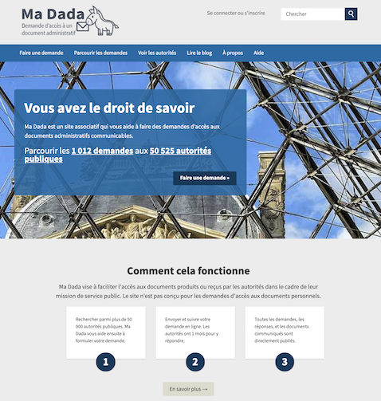
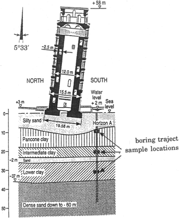
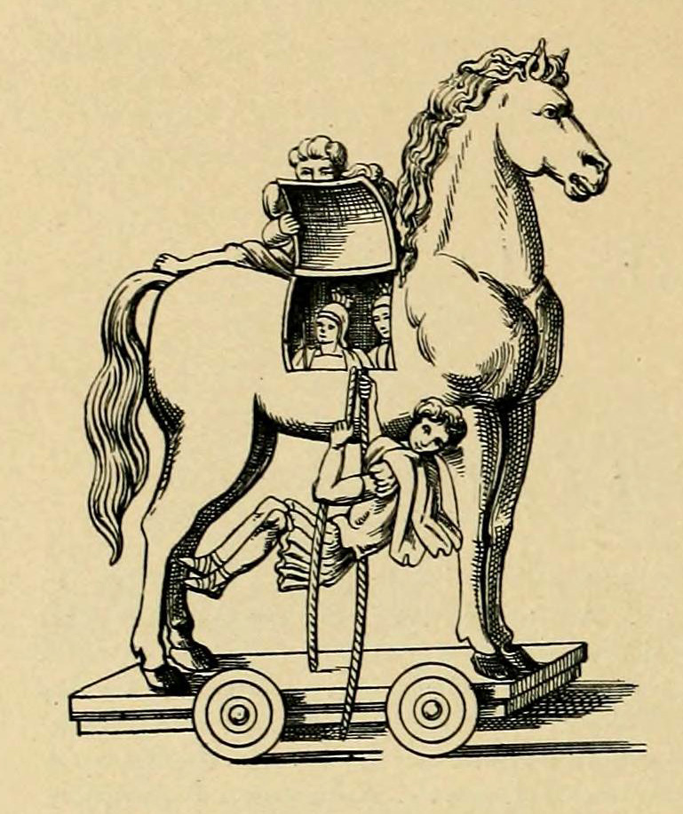
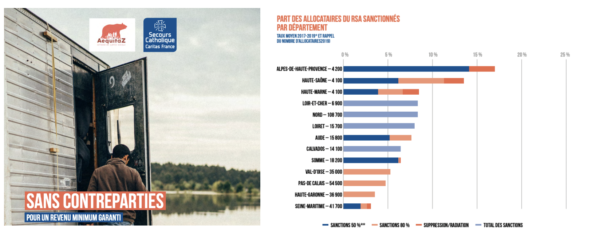
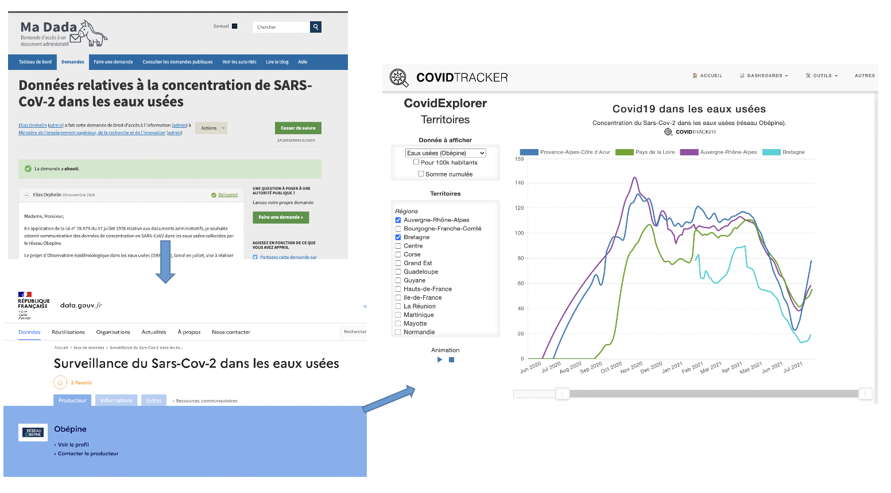
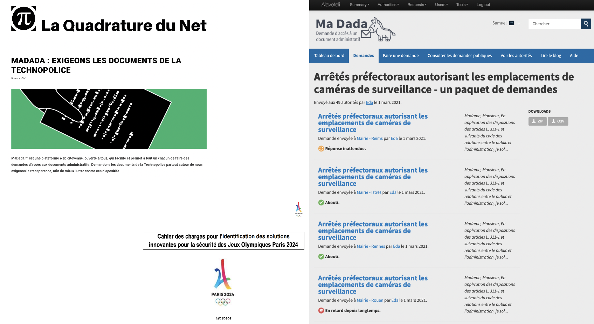
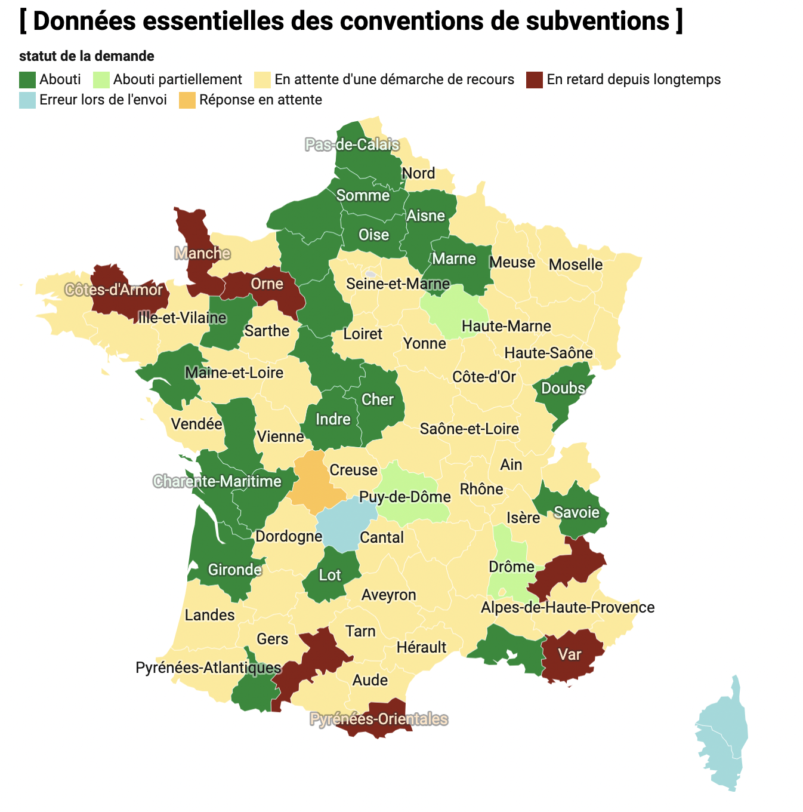

```{r xaringan-themer, include=FALSE, warning=FALSE}
library(xaringanthemer)
style_mono_light(base_color = "#23395b")
```

### Madada ?
A project of Open Knowledge Foundation France (okfn.fr) launched in October 2019 to simplify 
the use of the French FOIA law (loi CADA).

.center[]

---
### The leaning tower of open data in France 
.pull-left[
.center[]
]

--
.pull-right[
* Open Data is mandatory by the law since October 2018 (_loi pour une république numérique_).

* Each government department has just published an open data roadmap. More than 500 commitments [announced yesterday](https://www.data.gouv.fr/fr/datasets/liste-des-actions-prises-par-les-ministeres-dans-le-cadre-des-feuilles-de-routes-ministerielles/). 

* 🥈2nd country in OECD OURdata Index 2019 ranking open data policies.
* 🥉3rd country in EU Open Data Maturity Report
]

---
### A tower leaning because of its unstable foundations

.pull-left[

.center[]

]

--

.pull-right[

Loi CADA (1978) : a large definition of administrative documents, a simple procedure and an ombudsman (CADA). Now a constitutional right.

But…

* Awareness of the law is still weak among citizens and civil servants. 

* Requests are often bypassed or not even considered (50% of requests await response).

* FOIA officers and procedures are often not in place in government administrations. They too often await the ombudsman's intervention (_avis CADA_) before releasing documents.
]

---
### The making of madada

.pull-left[



![]

]

.pull-right[

* Building a small team of dedicated riders: Laurent, Pierre, Pascal, Eda… and with the help of MySociety, Transparencia.be, Ouvre Boite…

* Importing a quite massive database, the public service directory: 50k+ contacts 

* Requesting CADA its own email database (PRADA): a request first refused then approved…

* Explaining civil servants and citizens our approach based on publicity of exchanges…


]

---
### Sucess stories: report on sanctions for welfare benefits


> _"We assess that 115000 households are withdraw from the welfare revenues each year. […] "Thanks to Madada, almost all departments (101) have received our requests. After the legal deadline, only a third have give an acknowledgement of receipt (37) and 13 released the data."_ 

---
### Sucess stories: virus concentrations in sewage



---
### Success stories: La Quadrature, tracking surveillance



---
### Success stories: ensuring transparency on public procurement and subsidies

.pull-left[




]


.pull-right[
### _**In a nutshell, among 188 requests sent to departmental councils, we have received only 61 positive answer, less than 32%.**_


]


---
class: center, middle

# Thanks!

Let's discuss : hello /at / madada /dot/ fr